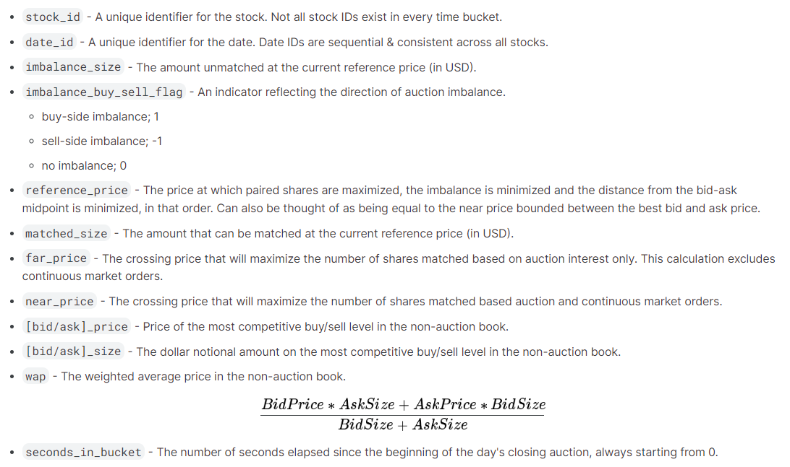
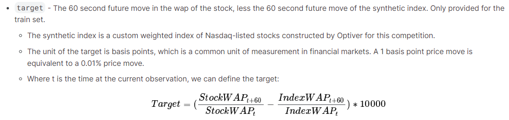

# Optiver

**Kaggle competition:**   
- Trading at the close by predicting US stocks closing movements in the last ten minutes of the Nasdaq exchange trading session.

**Input available data:**  
  

**Target variable to predict:**  
  

